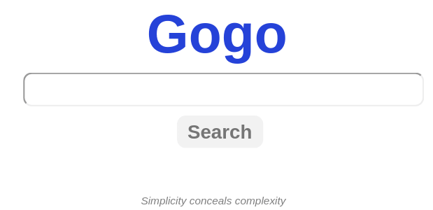
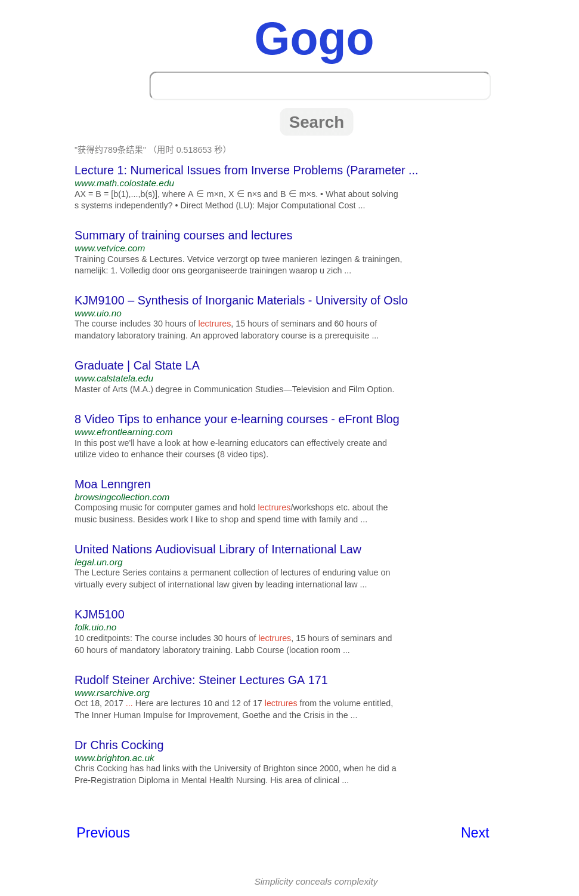
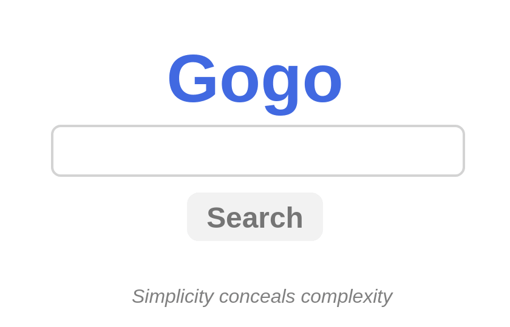
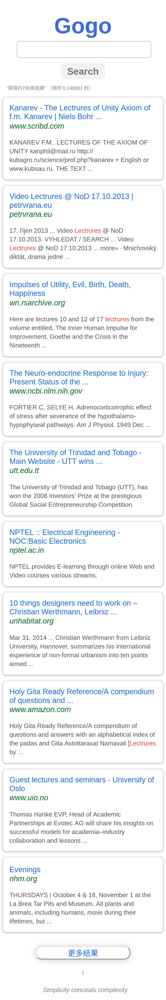

# gogosearch
  

Gogosearch is a Search Engine power by Flask and CSE (Google Custom Search Engine)

## Motivation

As I start to learn about Flask, I found [This project](https://github.com/yrq110/TinyGoogle) on Github. It's interesting. I build this project to learn how to build a search engine with [CSE](https://developers.google.com/custom-search/v1/overview) and [Flask](http://flask.pocoo.org/docs/1.0/) from scratch.

## Features

- Google-like UI ( Trying to be)
- Responsive web design ( Mobile optimization )

## Getting Started

As we are building Flask Web App, I assume you guys already kown Python package management basics.

The **Toolset** we'll use: Git, Pipenv ( or Pip)

### Prerequisites

Our project needs CSE API, so you need to apply for one, the details are [here](https://developers.google.com/custom-search/v1/overview). Also we will use Git to clone the project and Pipenv ( or Pip) to install the Pipfile ( or requirements for Pip). When you're ready, let's start!

### Install

```bash
$ mkdir workdirectory && cd workdirectory
$ git clone https://github.com/Bivectorfoil/gogosearch.git
$ cd gogosearch
$ pipenv install # for Pipenv tool
# Optional, for pip tool
$ pip install -r requirement.txt
```

### config

If things go well, we now have already install all the dependence. make sure we're at root directory of app

```bash
$ pwd
$ ~/workdirectory/gogosearch
```

As mentioned above, we need to create **.env** file to store the private setting ( CSE id, key or etc). a **.env** file will look like:

```python
# hold private env setting, DO NOT submit it to github.com
# Add this file to .gitignore

SECRET_KEY='set a hard to guess string'
CSE_ID=your_CSE_ID
CSE_key=your_CSE_key
URL=https://www.googleapis.com/customsearch/v1?

# proxies (optional, only use in local development enviroment, comment it in production enviroment) 
# has been dumps by json, type: string
# use json.loads to convert it to dict object to use
proxies='{"http": "socks5://127.0.0.1:1080", "https": "socks5://127.0.0.1:1080"}'
```

**.env** file is at the same directory as **.flaskenv** file.

### Run it!

```bash
$ pipenv shell # active virtual enviroment
$ flask run # default run at localhost:5000, production model
```

Now open the browser address bar and enter `localhost:5000`, if things go well, we will see the homepage, otherwise go back and check the steps clearly. good luck!

## Deployment

### Deploying on VPS

Use `setup.sh` to deploy or `uninstall.sh` to remove. 

**Deploy**

```bash
# ssh to your VPS, run command at root or sudo
$ mkdir workdir && cd workdir
$ git init --bare  # Create a bare Repo
$ git clone https://github.com/Bivectorfoil/gogosearch.git
$ cd gogosearch
$ scp .env root@your_ip_addr:/your_workdir_path  # cp env file(mention above) to VPS
$ chmod +x setup.sh  # add execution permission
$ ./setup.sh  # run setup script and wait for success or failure
```

If things go well, you should see your website at http://your_ip_or_domain.

**Note:** In the case of access through a **domain name**, you should correctly set the **domain name** in NGINX's configuration file rather than the **IP address**

**Uninstall**

```bash
# ssh to your VPS, run command at root or sudo
$ cd workdir
$ chmod +x uninstall.sh  # add execution permission
$ ./uninstall.sh  # run uninstall script and wait for success or failure
```

### Deploying on VPS with Docker (Recommended)

```bash
# Firstly ssh to your VPS, run command at root or sudo
$ git clone https://github.com/Bivectorfoil/gogosearch.git
$ cd gogosearch
$ scp .env root@your_ip:/path_to/gogosearch
$ chmod +x setup_docker.sh && ./setup_docker.sh # install docker-ce and docker compose

# Note: In the case of access through a domain name, you should correctly set the domain name in NGINX's configuration file rather than the IP address.

$ docker-compose up -d # Run the containers
$ docker-compose ps  # Check for status
```

#### Let's encrypt !

Since we already use docker for deployment, why shouldn't we go futher for **HTTPS** ? A little bit manual work needs to be done before we enjoy our **HTTPS** website. As follow:

```bash
# Add certbot for let's encrypt

$ sudo add-apt-repository ppa:certbot/certbot
$ sudo apt-get update
$ sudo apt-get install python-certbot-nginx
# Check whether we can access the Special index page though Nginx
$ curl http://your_domain_name/.well-known/
$ "test" # The return value, if not, pls go back and check the steps carefully before continue
```

```bash
# Creating the certificate

$ sudo certbot certonly --webroot -w letsencrypt -d your_domain_name
# Note: letsencrypt is the pre-created directory for holding the test index page which certbot needs to certificate. It should be in the same directory as LICENSE file.
```

As above, if things go well, you should see the `Web app` run at https://your_domain. 

I personally recommend using Docker for deployment cause it makes development and deployment( since I have already done the difficult part of it) more easier. You may want to read the official [documentation](https://docs.docker.com/) for more info.

### Deploying on Heroku

Please read the official doc on [Heroku](https://devcenter.heroku.com/articles/getting-started-with-python)

I also recommand use [Heroku](https://www.heroku.com/) to deploy project , as this project's first [demo](https://gogoso.herokuapp.com/) is host on it, you can also choose any other deployment method you like.

## TODO

- [ ] Test
- [x] Python 3 support
- [x] Docker deploy
- [x] Integrated HTTPS

## Screenshots

### Web





### Mobile





## License

This project is licensed under the MIT License - see the [LICENSE](./LICENSE) file for details
