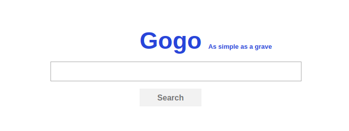
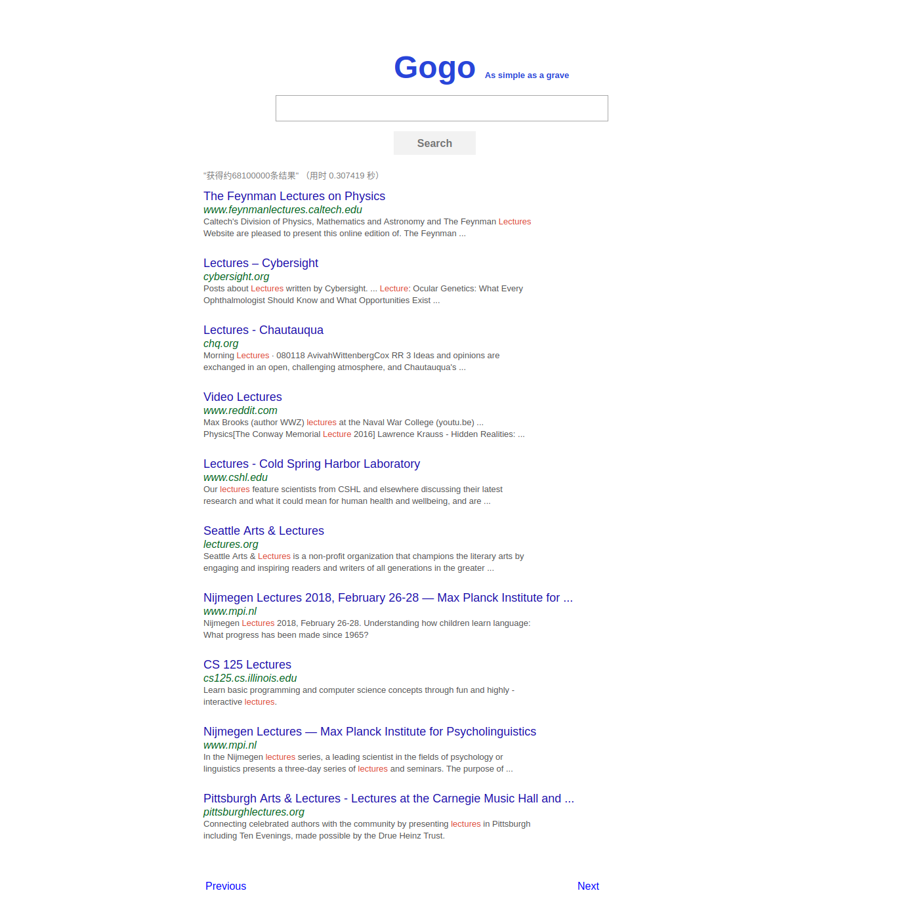

# gogosearch
 

Gogosearch is a Search Engine power by Flask and CSE (Google Custom Search Engine)

## Motivation

As I start to learn about Flask, I found [This project](https://github.com/yrq110/TinyGoogle) on Github. It's interesting. I build this project to learn how to build a search engine with [CSE](https://developers.google.com/custom-search/v1/overview) and [Flask](http://flask.pocoo.org/docs/1.0/) from scratch.

## Screenshots






## Getting Started

As we are building Flask Web App, I assume you guys already kown Python package management basics.

The **Toolset** we'll use: Git, Pipenv ( or Pip)

### Prerequisites

Our project needs CSE API, so you need to apply for one, the details are [here](https://developers.google.com/custom-search/v1/overview). Also we will use Git to clone the project and Pipenv ( or Pip) to install the Pipfile ( or requirements for Pip). When you're ready, let's start!

### Install

```bash
$ mkdir workdirectory && cd workdirectory
$ git clone https://github.com/Bivectorfoil/gogosearch.git
$ cd gogosearch
$ pipenv install # for Pipenv tool
$ pip install -p # optional, for pip tool
```

### config

If things go well, we now have already install all the dependence. make sure we're at root directory of app

```bash
$ pwd
$ ~/workdirectory/gogosearch
```

As mentioned above, we need to create **.env** file to store the private setting ( CSE id, key or etc). a **.env** file will look like:

```python
# hold private env setting, DO NOT submit it to github.com
# Add this file to .gitignore

SECRET_KEY='set a hard to guess string'
CSE_ID=your_CSE_ID
CSE_key=your_CSE_key
URL=https://www.googleapis.com/customsearch/v1?
```

**.env** file is at the same directory as **.flaskenv** file.

### Running the test (TODO)

TODO: add test for it

### Run it!

```bash
$ pipenv shell # active virtual enviroment
$ flask run # default run at localhost:5000, production model
```

Now open the browser address bar and enter `localhost:5000`, if things go well, we will see the homepage, otherwise go back and check the steps clearly. good luck!

## Deployment

### deploying on VPS

```bash
$ mkdir workdir && cd workdir
$ git init --bare  # Create a bare Repo
$ git clone https://github.com/Bivectorfoil/gogosearch.git
$ cd gogosearch
$ scp .env root@your_ip_addr  # cp env file(mention above) to VPS
$ chmod +x setup.sh  # Add execution permission
$ ./setup.sh  # run setup script and wait for success or failure
```

### deploying on Heroku

Please read the official doc on [Heroku](https://devcenter.heroku.com/articles/getting-started-with-python)

I recommand use [Heroku](https://www.heroku.com/) to deploy project , as this project's first [demo](https://gogoso.herokuapp.com/) is host on it, you can also choose any other deployment method you like.

## License

This project is licensed under the MIT License - see the [LICENSE](./LICENSE) file for details
